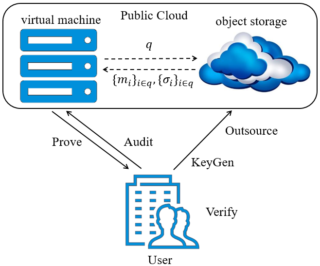

# cloud-object-storage-integrity-checking

COS-integrity-checking (cloud-object-storage-integrity-checking) is a cloud storage auditing system that works for current main-stream cloud object storage services. This system is designed over existing proof of data possession (PDP) schemes and make them practical as well as usable in the real world.

Our cloud storage auditing system has three part: client, server and cloud object storage (COS). COS-integrity-checking includes client and server while server will communicate with COS. The architecture is shown below. The client part is called the user and the server part is called the virtual machine.



We also provide a [python script](challenge_length.py) to compute the challenge length `l`.

## Build

We use Java 1.8.0_231 to develop this project and use IntelliJ IDEA and Maven to compile it.

Please import this project into IntelliJ IDEA and it will automatically import all dependencies in pom.xml.

## Usage

We provide compiled versions on the [release](https://github.com/fchen-group/cloud-object-storage-integrity-checking/releases) page, including server and client. You should ensure that the Java environment is currently installed.

**Server**

Before running the server, you need to specify the temporary upload directory and COS properties file. [Here](COS.properties.example) is a template for COS properties file. After all preparation are done, you will run a command in terminal to start server:

```
java -jar server.jar /path/to/temporary-upload-directory /path/to/COS-properties-file
```

**Client**

The client's command format is like this:

```
java -jar client.jar SERVER_IP COMMAND FILENAME [SECTOR_NUMBER]
```

You need to specify the server's ip, command (`outsource` or `audit`) and the name of the file. The `SECTOR_NUMBER` is only used in the outsource stage.

## Contributing

Please feel free to hack on COS-integrity-checking! We're happy to accept contributions.
